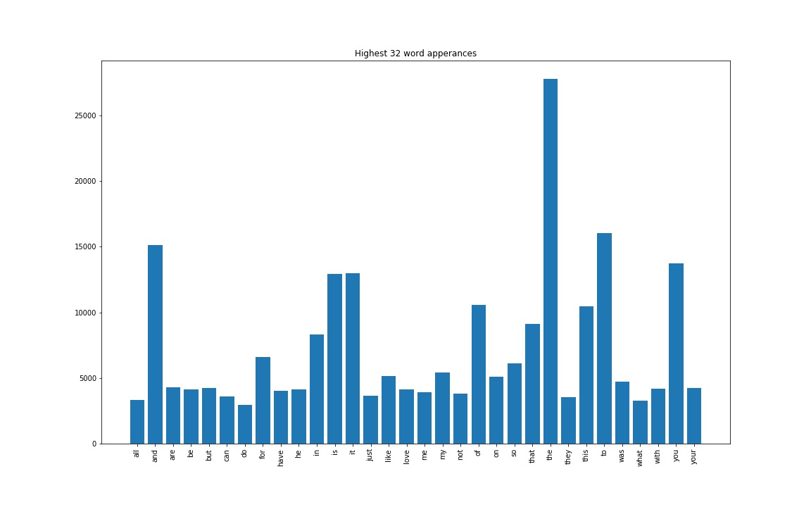
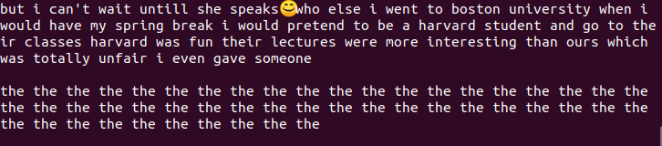
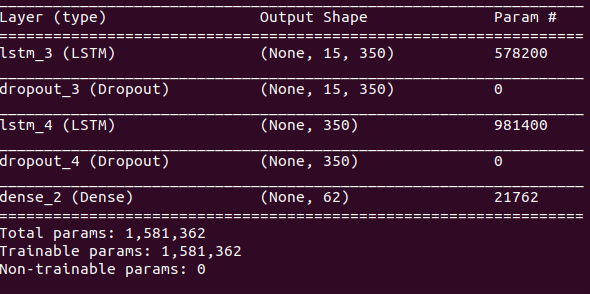
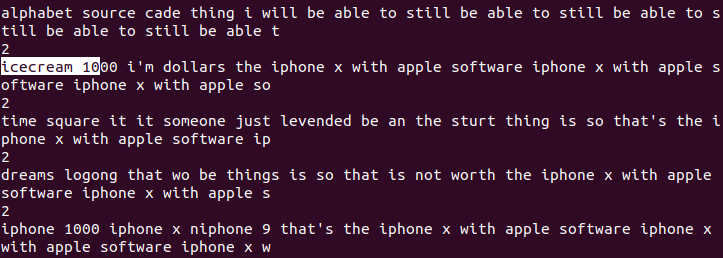

# WritingYoutubeComments

## Introduction

## The Data
Kaggle Open Datasets Uploaded by datasnaek:
[Youtube Comments](https://www.kaggle.com/datasnaek/youtube)

The dataset is a collection of webscraped comments from trending videos during the year 2017 in the USA and Great Britian.

The data consists of four CSV files and two json files, For this project I worked within the "UScomments.csv" file which contains around 700,000 entries.

The csv file has four columns "video_id", "comment_text", "likes" and "replies." Videoid is a small string of characters like "__YEG3bmU_WaI__" - which identifes the video "https://www.youtube.com/watch?v=YEG3bmU_WaI". "comment_text" is the actual text of the comments, "likes" is an integer value of how many likes the comment has, and "replies" is an integer value of how many replies the comments has.

I had one issue loading the data into pandas; some of the csv rows threw an error when read. They seemed to be some sort of header row from a different data file. Because it held no data I had no qualms with just deleting the rows out of the CSV file.
## EDA
My EDA was relatively boring, with 0 null values and mostly interested in the text there wasn't a whole lot to pursue. I did make a graph of the top 32 words that appeared the most.
 

## Latent Dirichlet Allocation
Because youtube comments in nature are so sporadic, I ran a quick and dirty Latent Dirichlet Allocation model to identify if there is any sort of consistancy between the comments. This dataset is so massive, I limited myself to the first 50,000 rows to save my sanity and computational power. Within these 50,000 rows there were 289 unique video id's, with each video id having 4 - 400 comments.

Running the model with the paramaters (n_jobs=-1, n_components=5).

n_jobs=-1: for the model to use all of the cores available to speed up training time.
n_components = 5: with 5 as a magic number I chose.

### Results

Topic 0: Doesn't seem to have much interpretability.

Topic 1: Seems to have some tendency towards music and also maybe something about Donald Trump.

Topic 2: This one is a very clear topic relating complimentary statements.

Topic 3: Seems to be about the Iphone, I think this topic exists so strongly even though it only makes up 400 rows of data is because this is one of the few videos were the comments are actually directed towards the content of the video.

Topic 4: I was hesitant to display this topic for obvious reasons, but I felt it would be unfair to my data if I were to hide this topic. Unfortunately, racism is a large part of youtube and online culture in General. Besides the one obvious outlier, this topic appears to be similar to topic 2.

Overall I'm happy with my quickly chosen LDA model.It displayed at least three interpretable topics, as well as giving a good insight into the different types of commenters.

## Recurrant Neural Network using Long Short Term Memory
### Preparing the Data
I initially limited it to 500 randomly selected rows from the 50,000, so I could have a model trained by the end of the year. As these neural networks start to grow exponetinally the more data gets added.

To train a RNN like this requires sequences of text:

  

From these sequences I split them into two categories X and Y. X is the first 9 characters/words of the sequence and Y is the very last character/word of the sequence. From there I proceeded to one hot encode every character/word into it's own vector. Once tharwas done, the model was ready to be created!

All in all I ended up with 8600 sequences.

### Attempt #1 Word-Based Model: 
I originally started out trying to create a word-based network that used a sequence length of 51(X=50, y=1).

My vocabulary here was around 2600.

The shape of my model 

Because the one hot encoded vectors were so large(1,2600~)I added an embedding layer to reduce the dimensionality, saving a massive amount of time/calculations.

Added two LSTM layers with 250 nodes per cell, as these are very good at retaining past context based on cell state.

Added one dense layer with 100 neurons to interpret the features extracted from the sequences. 

Added one more dense layer with the amount of neurons equal to our vocabulary(2600~) using a softmax activation function to actually generate a probability/prediction for each word. 

Using the model to predict required me to enter a "seed text" to the model. The seed text is exactly what you would think - a 50 word sequence and then appended the next predicted word onto the end of it.

I trained this model for two epochs, which took me about 9 minutes per epoch.

### My first model prediction

Can you tell which one my model wrote? The answer might shock you! Or not, it was the second one. 

I believe there are multiple reasons why this model failed, the most obvious one being that I only ran two epochs. That one is very obvious. I believe one of the less obvious ones is that I only had 250 neurons per layer in each LSTM cell. At a vocabulary of 2600 words, I believe this was a gross underestimate of how many neurons I would need.

You might be wondering why my model is only predicting 'the', I believe this is due to the accuracy of the model being so low. It locked in on one of the most common words in the sequences because it started out with such a high probability compared to all other words.

With more training I believe this model could at least start to predict other words. But my lame computer with its 3gb of ram could barely handle these minimal hyper paramters - so I decided to go a different route.

### Attempt 2 Character Based Prediction
With the character based model I used various sequence lengths 5,10,15 after all adjustments I ended up with a vocabulary of 62.

lstm_3 (LSTM)                (None, 15, 350)           578200    
____________________________________________________________
dense_2 (Dense)              (None, 62)                21762     

Total params: 1,581,362
Trainable params: 1,581,362
Non-trainable params: 0
____________________________________________________________

A very simple model with only two layers to begin with. I achieved a maximum accuracy of about 30% with this model which led to the same issue as above and predicting the same character over and over again.

To tune this model I started out with changing the sequence lengths, from 5-10-15 as the sequence length approached 10 I started to recieve better accuracy, moving past 10 it would slowly decrease again. So I locked myself in on 10.

I added more layers and increased the amount of neurons in my LSTM cells. Adding more neurons increased it's performance by a fair amount again with diminishing returns. More layers also contributed to the performance of the model. 

I also changed the data I was working with, I believe a major issue I was having was the inconsistencies in the types of comments chosen from random videos. Because of this I selected one of the unique id's from the dataset which turned out to be a first look video at the IPhone X. This had around 400 comments which I was working with.

Changing the Kernel Initalizer to "he_normal" helped as well. The kernel initalizer is the distrbution used to randomly generate the first weights. And the normal distrubution is a regular normal distribution centered around 0, but with a standard deviation of sqrt(2/#ofneuronsinlayer). This initializer has been found to help with vanishing gradients of activation functions like sigmoid and tanh. Here is a link to a paper written by Kaiming He, Xiangyu Zhang, Shaoqing Ren, Jian Sun discussing this [Paper](https://arxiv.org/abs/1502.01852).

After a few days of tweeking and turning knobs, the model I ended up with this model structure.

This model ended up with an accuracy of around 56% which finally let me break free of the repeating character prediction issues.

### Some Predictions

The first 10 characters see the highlighted example are again the seed text and all the following charcaters are the actual predictions based on the previous 10 letters. 

Some fun side by side comparsions of comments generated by my model and a real youtube comment!
Example 1:

'Bro y didnt u give merch to johannes he is ur boy 2'

'global wart it will be out on the s8 what if you th'

Example 2:

'Amk bunun trend de ne isi var'

'rambo oreofly the iphone x'

Example 3:

'i was 10 years old when it happened. 25 now. it looked like a demolition.'

'technology this is not worth the iphone x with apple software iphone x wi'

## Final Thoughts
I'd like to take a minute to discuss why tuning this model was difficult. Firstly I think that a lot of issue came from the data itself, as youtube comments are sporadic in their nature in more ways than one. People misspell their words constantly, as well as flat out skip important words which would add context to the sentence. Very few people use punctuation, so the model cannot use periods as a predictive character. The actual message they are trying to convey is probably related to the content of the video about 1/5 of the time. This makes it difficult even with locking in on one specifc video like I did.

Secondly I was very heavily limited computationally, each epoch taking about 5-7 minutes to run made for some difficulty checking if my tuning actually contributed to increasing the models performence. I do believe the model could perform a bit better but I don't have the time or equipment to keep persuing it at the moment. With better technology I would absolutely love to persue this project. It would be fun to see if I could get the word based predictor working a bit better.

Overall given the short time frame of the project, I am very happy with the results I've produced as well as all that I've learned. 

## Future Work
I'd like to improve these models more in the future when I have access to AWS/Spark.

I would love to have a text predictor which would spit out random words that aren't repeats of the previous one.

## Acknowledgements
I'd like to thank Jason Brownlee, PhD. for his excellent tutorials on setting up simple text predictor models. [Tutorial](https://machinelearningmastery.com/develop-character-based-neural-language-model-keras/)

Also thanking Christopher Olah fpor his fantastic blog post on LSTMS. [Post](http://colah.github.io/posts/2015-08-Understanding-LSTMs/)

Thanks to Danny, Kayla, and Frank for their support and guidance through the project!

