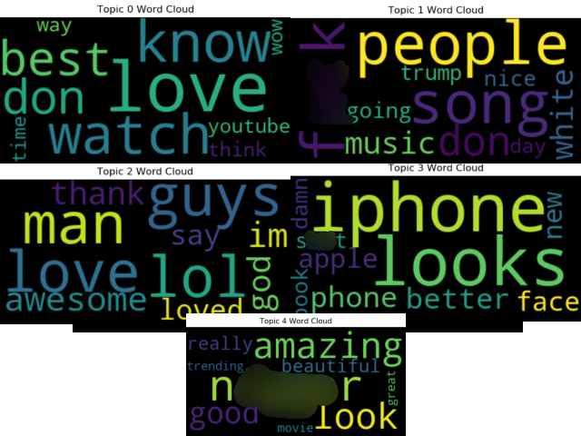
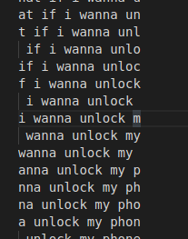
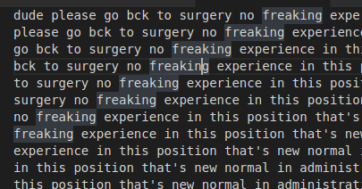
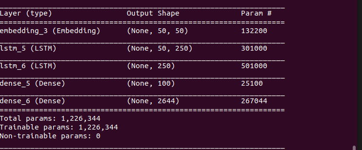

# WritingYoutubeComments

## Introduction

## The Data
Kaggle Open Datasets Uploaded by datasnaek:
[Youtube Comments](https://www.kaggle.com/datasnaek/youtube)

The dataset is a collection of webscraped comments from trending videos during the year 2017 in the USA and Great Britian.

The data consists of four CSV files and two json files for the purposes of this project I worked within the "UScomments.csv" file which held around 700 thousand entries.

This file consists of four columns "video_id", "comment_text", "likes", "replies", videoid is a small string of characters like "__YEG3bmU_WaI__" as an example of how it identifes the video "https://www.youtube.com/watch?v=__YEG3bmU_WaI__". Comment_text is the actual text of the comments, likes is an integer value of how many likes the comment has, and replies is an integer value of how many replies the comments has.

I had one issue loading the data into pandas, some of the csv rows threw an error when read in. They seemed to be some sort of header row from a different data file. Because it held no data I had no qualms with just deleting the rows out of the CSV file.
## EDA

## Latent Dirichlet Allocation
Because youtube comments in nature are so sporadic I thought running a quick and dirty Latent Dirichlet Allocation model to identify if there is any sort of consistancy between the comments. This dataset is so massive, I limited myself to the first 50,000 rows to save my sanity and computational power. Within these 50,000 rows there is 289 unique video id's, with each video id having 4 - 400 comments.

Running the model with the paramaters (n_jobs=-1, n_components=5).

n_jobs=-1: for the model to use all of the cores available to speed up training time.
n_components = 5: 5 as a magic number I chose.

### Results

Topic 0: Doesn't seem to have much interpretability.

Topic 1: Seems to have some tendacy towards music and also maybe something about Donald Trump.

Topic 2: This one is a very clear topic relating complimentary statements.

Topic 3: Seems to be about the Iphone, I think this topic exists so strongly even though it only makes up 400 rows of data is because this is one of the few videos were the comments are actually directed towards the content of the video.

Topic 4: I was hesitant to display this topic for obvious reasons, but I felt it would be unfair to my data if I were to hide this topic. Unfortunately racism is a large part of youtube and online culture in General. Otherwise the one obvious outlier this topic appears to be similar to topic 2.

Overall I'm happy with my quickly chosen LDA model it displayed at-least 3 interpretable topics as well as giving a good insight into the different types of commenters.

## Recurrant Neural Network using Long Short Term Memory
### Preparing the Data
I initally started out with 500 randomly selected rows from the 50,000 so I could have a model trained by the end of the year. As these neural networks start to grow exponetinally the more data you add.

To train a RNN like this requires sequences of text:

  

From these sequences you split them into two categorys X and Y. X is the first 9 characters/words of the sequence and Y is the very last character/word of the sequence. From there you proceed to one hot encode every character/word into it's own vector. Once you've done all of that you're ready to create your model!

Attempt #1 Word-Based Model: I originally started out trying to create a word-based network that used a sequence length of 51(X=50, y=1). 
The shape of my model was  

